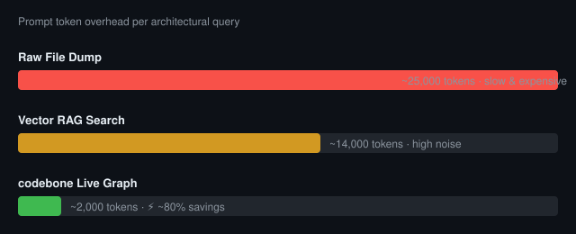

<div align="center">

# 🦴 codebone

### Your codebase has a structure. Give your AI access to it!
**Stop dumping dozens of files into your prompt. Let the dog sniff it.** 🐾

<br>

[](#)
[](#)
[](#)
[](CHANGELOG.md)
[](LICENSE)
[](#-privacy--security)

</div>

---

## 📉 Why codebone?

AI assistants typically read 10–20 files just to understand your architecture — burning thousands of tokens on boilerplate before writing a single line of code.

<p align="center">
  
</p>

codebone runs in your macOS menu bar, watches every file save, and delivers a live architectural snapshot directly to Claude, Cursor, or Gemini via MCP.

---

## 🚀 Download & Install

### [⬇️ Download](https://github.com/palusc/codebone/releases/latest/download/codebone-macos-arm64.dmg)

Drag `codebone.app` to `/Applications` — done. A 🦴 appears in your menu bar.

Click it → **Select Project Folder...** to start your first scan.

> 💾 ~750 MB total (~490 MB model + ~260 MB Python environment). Requires macOS 13+ on Apple Silicon.

<details>
<summary><b>Homebrew / Build from Source</b></summary>

<br>

**Homebrew:**
```bash
brew tap palusc/codebone
brew install codebone
```

**Build from source:**
```bash
git clone https://github.com/palusc/codebone.git
cd codebone
./install.sh
```

</details>

---

## ⚡ The `cb` Shortcut

You don't need to write long prompts like *"use codebone"* or *"inspect architecture"*. Simply type **`cb`** in any AI assistant (Claude, Cursor, Gemini):

* **`cb`** — Injects the live high-level architecture & active business domains into your AI context.
* **`cb: how does billing work?`** — Directly queries database models, API routes, and events for Billing.
* **`cb auth.py`** — Returns instant semantic context and cross-module links for that specific file.

codebone provides native `cb` MCP tools and prompts, recognized across all major AI agent environments.

---

## 🐾 How It Works

1. **Sniff** — Watches your repository on every `Cmd + S` with battery-aware debouncing (0.5s AC, 15s Battery).
2. **Think** — The built-in Apple Silicon Metal model extracts models, routes, events, and business domains (about 1.2 s per file measured on Apple Silicon; unchanged files are skipped by SHA-256).
3. **Map** — Links files into a Semantic System Graph based on shared business logic — bridging files that don't import each other.
4. **Serve** — Streams surgical architectural context to Claude, Cursor, or Gemini via **MCP** or **curl** in ~2k tokens.

<details>
<summary><b>🔍 Deep Dive: Architecture, Semantic Extraction & Live Graph</b></summary>

<br>

### 1. Concrete Semantic Extraction (The 5 Primitives)
For every file in your codebase, codebone's local Metal model extracts five structured architectural dimensions per file (about 1.2 s each, only for new or changed files):

- **Database Models & Tables** — Entities persisted by the module (e.g. `User`, `Subscription`, `Invoice`).
- **API Routes & Endpoints** — HTTP methods and paths exposed (e.g. `POST /api/v1/checkout`, `GET /webhook/stripe`).
- **Events & Webhooks** — Domain events emitted, handled, or dispatched (e.g. `InvoicePaid`, `PaymentFailed`).
- **Business Domains** — High-level systemic domains (e.g. `Billing & Subscriptions`, `Authentication & Identity`).
- **Logical Flow Summary** — A strict 1–2 sentence explanation of the module's actual role in the system.

```python
# Instead of feeding your AI 400 lines of raw boilerplate...
# codebone distills the file into pure architecture:
TABLES:  [Invoice, Subscription, PaymentRecord]
ROUTES:  [POST /api/v1/webhooks/stripe]
EVENTS:  [invoice.payment_succeeded, customer.subscription_deleted]
DOMAINS: [Billing & Subscriptions, Payment Processing]
FLOW:    Verifies Stripe webhook signatures and reconciles subscription status in PostgreSQL.
```

### 2. Solving the "Import Gap"
In traditional AST or grep-based tools, files are only connected if file A explicitly writes `import B`. But in real-world software:
- `billing/webhook.py` writes an `Invoice` record to the database.
- `cron/dunning.py` queries `Invoice` to retry failed cards.
- `emails/receipt.py` listens to the `invoice.payment_succeeded` event.

None of these files import each other. A file-dump or basic search misses the connection completely. **codebone links them automatically** through shared models, events, and domains into a unified Semantic System Graph. When you prompt your AI:
> *"How does subscription renewal work?"*

codebone answers with the matching files, their entities and their links in a few hundred tokens: a drill-down such as `cb(query="subscription renewal")` returned 170 to 370 tokens on a 56-file project, and the overview of that project (about 125,000 tokens of source) is about 1,500 tokens.

### 3. Interactive Live Graph UI
Inspect your codebase's real-time architecture visually:

```bash
open http://localhost:8053/codebone/graph/ui
```

- **Interactive Canvas** — Dark glassmorphic node-link visualization mapping every file and domain cluster.
- **Click-to-Inspect Drawer** — Click any node to view its exact tables, endpoints, events, and summary.
- **Instant Search** — Press `/` to filter nodes across the entire project in real time.
- **Auto-Sync** — Automatically updates live whenever you save a file.

### 4. Edit Resilience & Sandboxing
- **Syntax Tolerance**: If a file has broken syntax during typing (unclosed quotes or brackets), codebone quietly preserves the last known good state in SQLite without failing or dropping nodes.
- **Zero Battery Drain**: Automatically throttles debouncing from 0.5s to 15s when running on MacBook battery power.
- **Prompt Injection Defense**: Untrusted repository code is isolated with escaped XML wrappers and strict anti-jailbreak directives.

</details>

<a id="mcp-setup"></a>
## 💬 Usage with AI Assistants

Prompt naturally:
> *"Implement authentication middleware for billing routes. Use codebone."*

The model calls `codebone_context()` and receives the exact schemas, routes, and relationships it needs — no file dumping required.

<details open>
<summary><b>⚙️ Claude Desktop, Cursor & Gemini / Antigravity Configuration</b></summary>

<br>

codebone auto-registers during `./install.sh` and on application start. For manual setup in `claude_desktop_config.json`, `.cursor/mcp.json`, or `~/.gemini/config/mcp_config.json` (`~/.gemini/antigravity-ide/mcp_config.json`):

```json
{
  "mcpServers": {
    "codebone": {
      "command": "npx",
      "args": ["-y", "codebone-mcp"]
    }
  }
}
```

That's it — no Python paths, no manual configuration.

<details>
<summary>Direct Python Path (macOS bundle & source installs)</summary>

```json
{
  "mcpServers": {
    "codebone": {
      "command": "/Users/YOUR_USERNAME/Library/Application Support/codebone/venv/bin/python3",
      "args": ["-m", "codebone_mcp.server"],
      "env": { "CODEBONE_PORT": "8053" }
    }
  }
}
```

Replace `YOUR_USERNAME` with the output of `whoami`.

</details>

</details>

<details>
<summary><b>📋 Sample Context Payload</b></summary>

<br>

```markdown
# codebone — Codebase Architecture
Project: /Users/you/my_project | Files: 142 | Updated: 2026-09-23

## Business Domains
- Authentication & Identity (12 files: auth/router.py, auth/jwt.py, models/user.py …)
- Payment & Billing (8 files: billing/stripe.py, billing/webhook.py, models/invoice.py …)
- Order Fulfillment (15 files: orders/service.py, events/order_created.py …)

## Focused query: codebone_context(domain="billing")
→ Returns only billing files, models (Invoice, Subscription),
  routes (POST /checkout/session), and events (InvoicePaid, PaymentFailed).
```

</details>

<details>
<summary><b>🌐 Direct curl / Terminal</b></summary>

<br>

```bash
# Full architectural context
curl http://localhost:8053/codebone/context

# Filter by domain, file, or entity
curl 'http://localhost:8053/codebone/context?domain=billing'
curl 'http://localhost:8053/codebone/context?file=payments'
curl 'http://localhost:8053/codebone/context?query=InvoiceCreated'
```

</details>

---

## 🧠 Brains & Smart Engine

codebone pairs local-first Apple Silicon Metal acceleration with zero-cost smart indexing:

### 🧩 Flexible Brain Providers

| Provider | Description | Latency |
|---|---|---|
| **Built-in (Qwen 0.5B)** *(default)* | Apple Silicon Metal GPU acceleration. 100% offline, zero cloud, zero cost. | `~1.2 s / file` |
| **Deep Scan Mode (7B)** | One-click full re-analysis with 7B parameters, automatically reverting to 0.5B. | Thorough |
| **Local URL** | Ollama, LM Studio, vLLM, or any OpenAI-compatible local endpoint. | Custom |
| **Cloud BYOK** | Your own API key — Anthropic (`Claude Sonnet 5`) or OpenAI (`GPT-6`). | Zero RAM |
| **Custom .gguf** | Load any GGUF model directly via macOS file dialog (Qwen 7B, Llama 3, etc.). | Native Metal |

> ⚙️ Switch anytime via 🦴 ➔ **Settings** ➔ **Model**.

### ⚡ Smart Scan & Instant Adoption

Never re-scan from scratch when switching branches or reorganizing code:

- **SHA-256 Fingerprinting (0 LLM Cost)**: Renamed, moved, or refactored files match their cryptographic hash and are re-linked in SQLite immediately without invoking the model.
- **Branch Switch Batching**: Coalesces rapid burst events (e.g. `git checkout`) into bulk reconciliation.
- **Portable Scan Snapshots**: Save, export, or adopt pre-computed `.sqlite3` architecture snapshots across folders or team machines via 🦴 ➔ **Adopt / Link Existing Scan...** or REST API (`/codebone/scans`).

---

## 🧩 Modules: use another model for coding

Add a model API once, then choose per app whether it uses it. Each app has its own on/off switch.

1. 🦴 ➔ **Modules** ➔ **Add Module...**: pick the **MiMo V2.6 Pro (Xiaomi)** preset, or **Custom...** with a model ID and a base URL in Anthropic format (for Claude Code) and/or OpenAI format (for opencode). The API key goes into your macOS Keychain.
2. Under **Use for ...** switch on the apps that should use it. **Claude Code** (terminal and VS Code) and **opencode** are supported directly. New sessions pick the change up; running sessions keep their model.
3. Switch an app off and codebone restores exactly the settings it changed in that app's config (`~/.claude/settings.json`, `~/.config/opencode/opencode.json`) and leaves everything else alone. A settings file that cannot be parsed is never touched.
4. Any other app (Cursor, Antigravity, Cline, ...): **Copy for Other Apps** copies the base URL, model ID or API key so you can paste them into that app's model settings.

Claude Code fetches the key from the Keychain on demand. opencode can only read a key from a file or environment variable, so for it codebone keeps a private key file (owner-only) in its own data folder and deletes it when the app is switched off. Modules are for coding only; the model that indexes your project stays under **Settings ➔ Model**. Uninstalling codebone switches every app back and deletes the stored keys. Your code goes to the module's provider like with any hosted model.

---

## 🔒 Privacy & Security

- **100% Localhost** — Binds to `127.0.0.1:8053` only. Zero cloud, zero telemetry. The API refuses requests with a foreign `Host` or `Origin` header, so a web page in your browser cannot read from or control it.
- **Secrets stay out** — `.env` files, private keys, `credentials*`/`secrets*` files and files over 1 MB are never read or sent to any model.
- **Prompt Injection Defense** — Untrusted code is isolated with escaped XML wrappers and strict anti-jailbreak directives.
- **Symlink Jail** — Symlinks cannot escape the project root into sensitive system paths.
- **Full Disk Access Helper** — Pre-flight TCC check with 1-click System Settings shortcut.
- **Battery-Aware** — 0.5s debounce on AC, 15s on battery.

---

## ❓ Frequently Asked Questions

<details>
<summary><h3><b>💬 Questions you might have (FAQ) — Click to expand</b></h3></summary>

<br>

> **The important part isn't making your AI work harder. It's doing the repetitive context work before your AI session starts.**

---

#### Why does codebone run locally 24/7?
codebone keeps your codebase graph continuously updated in the background. The local model can process changes independently of your AI session, so architectural context does not have to be rebuilt every time you start a new cloud session.

#### Does codebone replace Claude, Cursor, Gemini, or Codex?
No. codebone provides architectural context to the AI tools you already use through MCP. Your existing AI model still generates the code.

#### Why not just let my AI read the repository itself?
It can. The difference is that codebone continuously prepares and maintains a compact semantic representation of the codebase locally, instead of repeatedly discovering the same structure during individual AI sessions.

#### Does codebone actually make AI coding better?
The primary goal is to provide more relevant architectural context with less repeated file-level context. The effect depends on the codebase, task, and AI agent. The most meaningful comparison is a real feature task on the same repository with and without codebone.

#### Does it send my code to the cloud?
By default, no. codebone runs locally and binds strictly to `localhost` (`127.0.0.1:8053`). Cloud models can optionally be used with your own API key (BYOK).

#### Why is the local model small?
The local model is not intended to replace your main coding model. Its job is to continuously analyze and structure your codebase in the background. The main AI agent can then use that prepared context.

#### Does it use tokens while I'm not actively using Claude/Cursor/etc.?
No. All continuous processing happens locally on your machine via Apple Silicon Metal GPU. It does not consume API tokens simply because codebone is running.

#### What happens if my AI session ends?
The codebase graph remains available in SQLite. codebone continues running independently in the menu bar and keeps the graph up to date as you write code.

#### Is this just another RAG system?
codebone focuses on a continuously maintained semantic system graph of domains, models, routes, events, and relationships rather than only retrieving similar text chunks. The actual usefulness depends on the project and query.

</details>

---

## 🗑️ Uninstall

<details>
<summary><b>How to completely remove codebone</b></summary>

<br>

**From the app (recommended):** 🦴 ➔ **Settings** ➔ **Uninstall codebone...**. It lists everything it will remove (the app, application data and models, logs, caches, preferences, login items, and codebone's entries in the Claude Code, Claude Desktop, Cursor and Gemini configs), asks once, removes it all and quits. Your project folders are never touched.

**Terminal:**
```bash
./uninstall.sh --dry-run   # show what would be removed
./uninstall.sh --yes       # remove everything without asking
```
Installed with Homebrew? The uninstaller also runs `brew uninstall codebone` for you.

</details>

---


<div align="center">

Released under the [MIT License](LICENSE).

</div>
