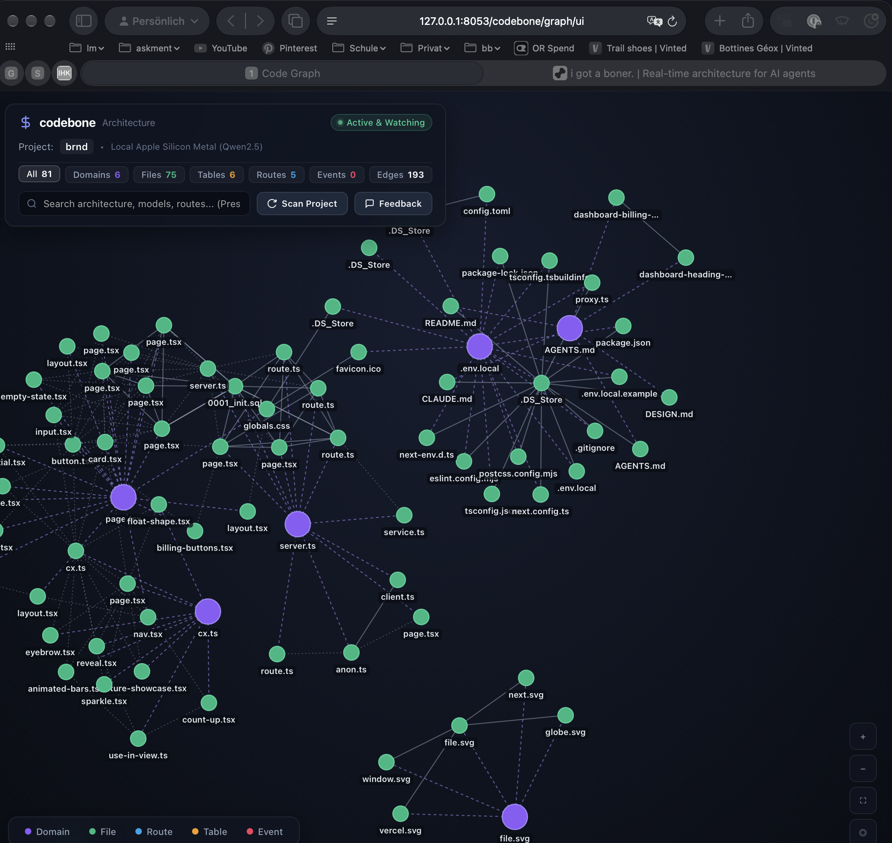

<div align="center">

# 🦴 codebone

### Give your coding agent the map. Not the whole repo.

codebone turns a codebase into a live, local architecture graph and serves focused context to AI coding agents through MCP.

[**Download for macOS**](https://github.com/palusc/codebone/releases/latest/download/codebone-macos-arm64.dmg) · [Website](https://codeb.one) · [Benchmark](https://github.com/palusc/codebone-benchmark) · [Latest release](https://github.com/palusc/codebone/releases/latest)

[](https://github.com/palusc/codebone/releases/latest)
[](#requirements)
[](#mcp-setup)
[](LICENSE)

</div>



## What codebone changes

Coding agents can read repositories, but they often spend the beginning of every session rediscovering the same architecture: searching for routes, opening models, tracing events and guessing how distant files belong to one system flow.

codebone prepares that map before the task starts. It watches your project, builds a structured graph and lets an MCP-compatible agent request only the relevant slice.

- **Deterministic facts:** routes, tables, models, events, imports and source matches.
- **Semantic relationships:** business domains and connections across files that do not import one another.
- **Focused retrieval:** project overview, domain context, file neighborhoods and ranked queries.
- **Live updates:** changed files are reconciled incrementally while you work.
- **Local by default:** the built-in map agent and SQLite graph run on your Mac.

## Quick start

1. [Download the latest DMG](https://github.com/palusc/codebone/releases/latest/download/codebone-macos-arm64.dmg).
2. Drag `codebone.app` to `/Applications` and open it.
3. Click the bone in the menu bar and select a project folder.
4. Open your coding agent and type `cb`.

Requires macOS 13 or later on Apple Silicon. The current release is arm64 only.

## One shortcut

| Prompt | What the agent receives |
|---|---|
| `cb` | Project overview, active domains and important relationships |
| `cb: how does billing work?` | Ranked files, source lines, models, routes and events for the question |
| `cb auth.py` | Context and incoming/outgoing links for one file |
| `codebone_tldr()` | A short whole-project architectural summary |

Example focused output:

```text
cb(query="subscription renewal")

billing/webhook.py                         HIGH
ROUTE   POST /api/webhooks/stripe
EVENT   invoice.payment_succeeded
TABLES  Invoice, Subscription

Related
cron/dunning.py · emails/receipt.py · models/subscription.py

Flow
Verifies the webhook, reconciles the subscription, then emits
the receipt event.
```

The example shows the output shape. Actual results are generated from the current repository.

## How it works

```text
repository changes
       │
       ▼
deterministic source scan ── routes · tables · events · imports
       │
       ▼
grounded local synthesis ─── domains · flow summaries
       │
       ▼
live SQLite system graph ─── shared entities · cross-file links
       │
       ▼
MCP / localhost API ──────── focused context for your coding agent
```

1. **Scan what the code proves.** Static passes extract concrete source facts across Python, TypeScript/JavaScript, Go, Rust, Java, C#, PHP, Ruby, SQL and common frameworks.
2. **Connect what imports miss.** Shared tables, routes, events and domains link files that participate in the same system flow.
3. **Serve the useful slice.** `cb` returns an overview or a ranked, focused answer instead of a repository dump.
4. **Stay current.** File watching updates changed files, skips unchanged content by SHA-256 and preserves the last good state during temporarily broken edits.

## Local by default

With the built-in map agent:

- the service binds to `127.0.0.1`;
- the architecture graph is stored in local SQLite;
- the bundled Qwen2.5-Coder 0.5B model runs on Apple Metal;
- `.env` files, private keys and credential-like files are excluded;
- foreign `Host` and `Origin` requests are rejected;
- there is no required cloud account.

Cloud BYOK providers are optional. If you explicitly configure one, relevant source can be sent to that provider under its terms.

## Works with your agent

codebone exposes a native MCP server and local HTTP API. It can be used by Claude Code, Cursor, Codex, Gemini/Antigravity, opencode and other MCP-compatible clients.

Your existing agent still reasons about the task and writes the code. codebone supplies the architecture layer underneath it.

<a id="mcp-setup"></a>
## MCP setup

The app registers supported clients during setup. A portable manual configuration is:

```json
{
  "mcpServers": {
    "codebone": {
      "command": "npx",
      "args": ["-y", "codebone-mcp"]
    }
  }
}
```

The local API is also available while the app is running:

```bash
# Whole-project architecture overview
curl http://127.0.0.1:8053/codebone/context

# Focused architectural query
curl 'http://127.0.0.1:8053/codebone/context?query=subscription%20renewal&offer=true'

# Short project summary
curl http://127.0.0.1:8053/codebone/tldr

# Interactive graph
open http://127.0.0.1:8053/codebone/graph/ui
```

If port `8053` is occupied, codebone chooses the next free local port. The MCP bridge discovers the active instance automatically.

## Reproducible benchmark

There is deliberately no magic percentage here. [`codebone-benchmark`](https://github.com/palusc/codebone-benchmark) provides:

- the same messy mini-project for every run;
- the same three-part change request;
- a mechanical `3/3` checker;
- a recorder for model, mode, wall time, tokens and cost.

Run the task with and without codebone on the same model and compare the result yourself. The harness is maintained by this project; it is reproducible evidence, not an independent study.

## Architecture surfaces

| Surface | Purpose |
|---|---|
| Menu bar app | Project selection, scan controls, model settings and graph launcher |
| `cb` MCP tool | Overview and focused architecture retrieval |
| `codebone_tldr` | Compact project summary |
| Live graph UI | Interactive files, domains, routes, tables, events and edges |
| Local HTTP API | Context, graph, status, scan and feedback endpoints |
| SQLite storage | Persistent architecture facts and relationships |

## Requirements

- macOS 13 Ventura or later
- Apple Silicon (`arm64`)
- 8 GB memory minimum
- approximately 2 GB free disk space for the app, runtime, model and local data

Intel Macs, Windows and Linux are not supported release targets today.

## Build from source

```bash
git clone https://github.com/palusc/codebone.git
cd codebone
./install.sh
```

The installer validates macOS and Apple Silicon before changing the system.

Run the test suite from a development checkout:

```bash
python3 -m pytest
```

## Documentation

- [Changelog](CHANGELOG.md)
- [Releases](https://github.com/palusc/codebone/releases)
- [Benchmark harness](https://github.com/palusc/codebone-benchmark)
- [Issue tracker](https://github.com/palusc/codebone/issues)
- [License](LICENSE)

## Uninstall

Use **Settings → Uninstall codebone…** in the menu bar app, or run:

```bash
./uninstall.sh --dry-run
./uninstall.sh --yes
```

The uninstaller removes codebone's app data and agent configuration entries. It does not delete project folders.

---

<div align="center">

Your agent can read the files. Give it the system.

Released under the [MIT License](LICENSE).

</div>
