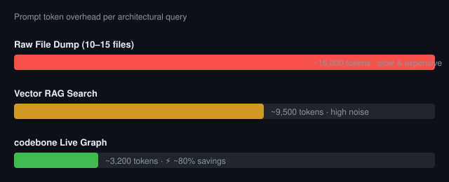

<div align="center">

# 🦴 CodeBone

### Real-time codebase knowledge graph for your macOS menu bar.
**Deliver clean architectural context without bloating your prompt tokens.**

<br>

[](#)
[](#)
[](#)
[](CHANGELOG.md)
[](LICENSE)
[](#-privacy--security)

<br>

*Never dump dozens of raw files into your prompt just to explain your architecture. Let the dog sniff it.* 🐾

</div>

---

## 📉 Token Savings

When asking AI assistants (Claude, Cursor, Gemini, Codex) to build a feature, they typically read 10 to 20 files just to discover schemas, routes, and events. That burns thousands of tokens on boilerplate before writing any code.

<p align="center">
  
</p>

---

## 🐾 How It Works

CodeBone runs silently in your macOS menu bar and updates on every file save (`Cmd + S`):

1. **Sniff**: Watches repository files in real time with battery-aware debouncing.
2. **Think**: Apple Silicon Metal GPU extracts business domains, models, routes, and events in `<1s`.
3. **Map**: Synthesizes a relational Semantic System Graph linking files across overarching business capabilities.
4. **Serve**: Delivers instant architectural context to AI assistants via **MCP** or **curl**.

> 💡 **Beyond Code Imports:** Static parsers only see explicit `import` statements. CodeBone connects files through shared business logic (e.g. `billing.py` and `user_notification.py` via *Payment Processing*) even when no direct code import exists.

---

## 🚀 Quick Start

```bash
git clone https://github.com/palusc/codebone.git
cd codebone
./install.sh
```

A bone icon **🦴** appears in your macOS menu bar. Click it ➔ **Select Project Folder...** to begin.

> 💾 **Lightweight:** Requires **~650 MB disk space** total (~390 MB model + ~260 MB venv) and **< 1 GB RAM**.

---

## ⚡ Built for 24/7 Background Operation

CodeBone runs continuously in the background without getting in your way:

* **0.5B Model by Default**: Fast (`< 1s`), tiny (~390 MB RAM), and completely silent. Your Mac's fans stay off and your battery is preserved. CodeBone indexes structure; your frontier model (Claude Opus 5.5, GPT-6 Astra) writes the code.
* **Apple Silicon Metal GPU**: Zero CPU overhead. Runs entirely on unified memory via Metal shaders.
* **Smart Scan Adoption**: SHA-256 fingerprinting recognizes moved or renamed files instantly. You never have to re-scan a project from scratch after renaming a directory or switching branches.
* **100% Localhost**: Binds strictly to `127.0.0.1:3000`. Zero cloud, zero telemetry, zero tokens leaving your machine.

---

## 🔄 Smart Scan Adoption

Renamed, moved, or branched a project folder? **Never re-scan from scratch.**

CodeBone matches identical files via SHA-256 (0-cost instant reuse), sniffs only modified files, and reconciles the architecture automatically.

* **Menu Bar**: Click 🦴 ➔ **Adopt / Link Existing Scan...** (or pick a renamed folder for auto-detection).
* **Snapshots**: Click 🦴 ➔ **More...** ➔ **Export / Import Scan Snapshot (.sqlite3)**.

<details>
<summary><b>⚙️ Adoption Architecture & API Details (Click to expand)</b></summary>

<br>

```text
[Target Project Folder] ◀── Compare ──▶ [Existing Codebase Scan]
          │
          ├── ⚡ Content Hash Match (SHA-256): 0-cost instant reuse (zero LLM latency)
          ├── 🔄 Moved / Renamed Files: auto-detected by hash & re-linked in database
          ├── 🧠 Modified / New Files: only the diff is sniffed by the AI brain
          └── 🗺️ AI Architecture Pass: LLM reconciles overarching business domains
```

```bash
# List all saved codebase scans
curl http://localhost:3000/codebone/scans

# Adopt a scan for a moved or renamed project
curl -X POST http://localhost:3000/codebone/scans/adopt \
     -H "Content-Type: application/json" \
     -d '{"scan_id": "my_app_1790102978", "project_path": "/Users/you/Desktop/my_app_renamed"}'
```

</details>

---

## 💬 Usage with AI Assistants

Prompt your AI model naturally:
> *"Implement authentication middleware for billing routes. Use CodeBone."*

The model detects `CodeBone`, calls `codebone_context()`, and immediately receives the exact database models, routes, and dependency graph.

<details>
<summary><b>⚙️ Cursor & Claude Desktop Configuration (Click to expand)</b></summary>

<br>

CodeBone auto-registers with Claude CLI during `./install.sh`. To configure **Claude Desktop** or **Cursor**, add this block to your MCP config (`claude_desktop_config.json` or `.cursor/mcp.json`):

```json
{
  "mcpServers": {
    "codebone": {
      "command": "/Users/YOUR_USERNAME/Library/Application Support/CodeBone/venv/bin/python3",
      "args": ["/Users/YOUR_USERNAME/Library/Application Support/CodeBone/src/codebone_mcp/server.py"]
    }
  }
}
```

</details>

<details>
<summary><b>🌐 Direct Curl / Terminal Option (Click to expand)</b></summary>

<br>

Fetch the live architectural context directly from your terminal:

```bash
curl http://localhost:3000/codebone/context
```

Returns Markdown structured specifically for LLMs:
* **Business Domains & Systems**: High-level architectural capabilities grouping related modules.
* **Entities**: Database models, ORM tables, API routes, and event emitters.
* **Semantic System Graph**: Cross-module business relationships beyond rigid code imports.
* **Recent Changes**: Chronological log of recent file modifications and their logical purpose.

**Level-of-Detail (LOD) filtering** — Reduce token usage further on large repos:

```bash
# Only files in the "billing" domain
curl 'http://localhost:3000/codebone/context?domain=billing'

# Files matching a specific path
curl 'http://localhost:3000/codebone/context?file=payments'

# Files touching a specific table, route, or event
curl 'http://localhost:3000/codebone/context?query=InvoiceCreated'
```

Or via the MCP tool: `codebone_context(domain="billing")` — the AI only loads the relevant slice.

*(Note: `/pug/...` endpoints are also supported for backwards compatibility).*

</details>

---

## 🗺️ Live Graph UI

Visualize your Semantic System Graph as an interactive node-link diagram in any browser:

```bash
open http://localhost:3000/codebone/graph/ui
```

Or click 🦴 **More... → View Live Graph...** in the menu bar. The graph:
- **Auto-refreshes every 5 seconds** to reflect the latest file saves
- **Color-codes** nodes by type: Domains (purple), Files (green), Routes (cyan), Tables (amber), Events (rose)
- **Pan / Zoom** with mouse drag and scroll wheel
- **Click any node** to inspect its connections in a slide-out panel

---

## 🧠 Brain Options

Click the bone icon 🦴 ➔ **More...** ➔ **Brain Selection**:

| Provider | Description |
|---|---|
| **Built-in (Qwen 0.5B)** *(default)* | Apple Silicon Metal GPU-accelerated. Zero cost, zero cloud, instant setup. |
| **Local URL** | Connect to local Ollama (`http://localhost:11434/api/generate`) or LM Studio. |
| **Cloud BYOK** | Use your own API key for OpenAI (`gpt-6-luna`) or Anthropic (`claude-haiku-4-5`). |
| **Custom .gguf** | Load any local GGUF model file (e.g. Qwen 7B, Llama 3) via native file dialog. |

---

## 🔬 Deep Scan Mode (Advanced)

The default 0.5B brain is tuned for speed, not depth. If your architecture is dense enough that the fast pass misses relationships, **Deep Scan Mode** re-runs a full project sniff through a larger local model you supply (e.g. **Qwen2.5-Coder 7B**) for a more thorough one-off pass, then automatically switches back to the fast 0.5B brain for everyday saves.

Click 🦴 ➔ **More...** ➔ **Brain Selection** ➔ **Deep Scan Mode (7B)...** and point it at a `.gguf` file.

> ⚠️ **Know what you're doing before you turn this on.** A 7B model needs far more RAM, disk, and time than the built-in 0.5B brain, and re-sniffing a large repo can take minutes instead of seconds. It's opt-in and off by default — recommended only if you're comfortable managing local GGUF models yourself.

---

## 🔒 Privacy & Security

* **100% Localhost**: Binds strictly to `127.0.0.1:3000`. No external network exposure, zero telemetry.
* **Metal Acceleration**: Runs on Apple Silicon GPU / Neural Engine (`-DGGML_METAL=on`). Minimal CPU impact.
* **Battery-Aware**: Detects MacBook battery power and increases debounce intervals to conserve energy.

---

## 🗑️ Uninstall

<details>
<summary><b>Uninstall commands (Click to expand)</b></summary>

<br>

```bash
# Standard uninstall (removes app & environment, keeps ~390 MB model for fast reinstall):
./uninstall.sh

# Full cleanup (completely wipes all ~650 MB: app, database, logs, and local model):
./uninstall.sh --all
```

> ℹ️ *Note: Models and index data reside in `~/Library/Application Support/CodeBone/`, completely separated from your project repositories.*

</details>

---

<div align="center">

Released under the [MIT License](LICENSE).

</div>
